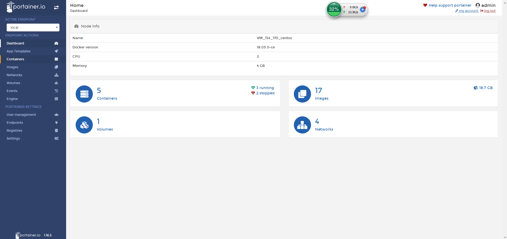

# portainer 

portainer 是一款 Docker 可视化容器管理工具

官网：https://portainer.io/

只需两句命令即可安装：

````shell
$ docker volume create portainer_data
$ docker run -d -p 9000:9000 -v /var/run/docker.sock:/var/run/docker.sock -v portainer_data:/data portainer/portainer
````

文档地址：https://portainer.readthedocs.io/en/latest/faq.html

